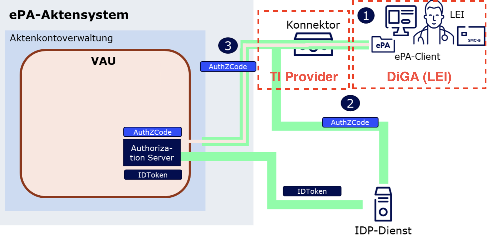

# Overview

# Open Questions

1. What is the source of truth for TI root certififcates?  https://gemspec.gematik.de/docs/gemSpec/gemSpec_Krypt/latest/#5.1 ?
2. How to check stapled OCSP response? com.oviva.telematik.vau.httpclient.internal.cert.TrustStoreValidator.validate
3. Who to talk to for VAU tunnel in general at Gematik?

## References
- [TI Leitfaden for DiGAs](https://wiki.gematik.de/pages/viewpage.action?pageId=512716463)
- [GemSpec Trusted-Environment Authorization, chapter 3.3](https://gemspec.gematik.de/docs/gemILF/gemILF_PS_ePA/gemILF_PS_ePA_V3.2.3/#3.3)
- [Gematik OpenAPI Spec I_Authorization_Service](https://github.com/gematik/ePA-Basic/blob/ePA-3.0.3/src/openapi/I_Authorization_Service.yaml)
- [Authorization Code: Structure](https://gemspec.gematik.de/docs/gemSpec/gemSpec_IDP_Dienst/gemSpec_IDP_Dienst_V1.7.0/#7.3)

## Glossary

- **LEI** - Service Provider (Leistungs Institution)
- **TI** - Telematik Infrastruktur

## Overview
from [ILF PS ePA4all](https://gemspec.gematik.de/docs/gemILF/gemILF_PS_ePA/gemILF_PS_ePA_V3.2.3/#3.3.2)
